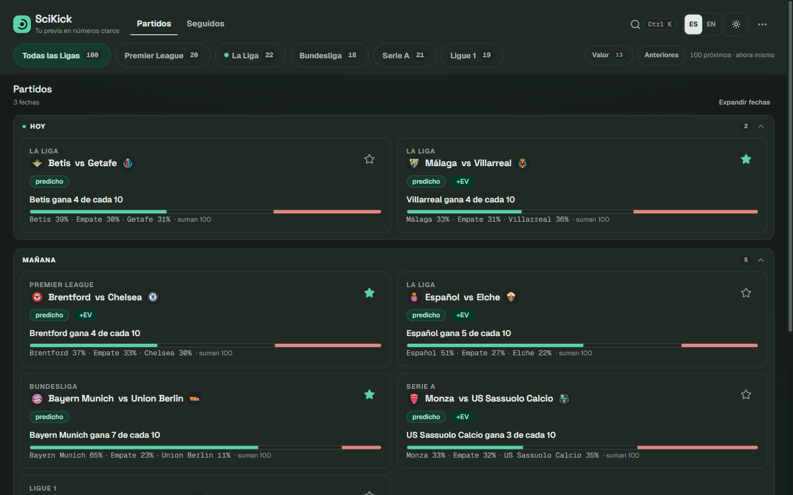
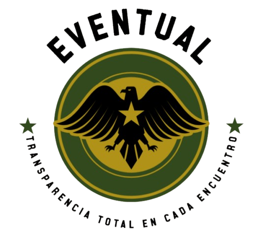

# Pablo Domínguez — Portfolio 2026

> Full Stack Developer · Software Engineering student at ESPE · Quito, Ecuador

Production software in use daily (dental clinic system), solo-built event platform with 137 passing tests, and live ML-powered football analytics. Freelance developer and co-author of a paper submitted to IEEE BigData 2026.

[](https://pablo004.is-a.dev)
[](https://nextjs.org)
[](https://www.typescriptlang.org)
[](https://tailwindcss.com)

---

## 🌐 Live

**[pablo004.is-a.dev](https://pablo004.is-a.dev)**


---

## 🚀 Featured work

| | Project | Proof |
|---|---|---|
|  | **[Summer Dent](https://aplicacion-summer-dent.vercel.app/login)** — clinic management in production (patients, appointments, inventory, finance) | Live app in daily use |
|  | **[SciKick](https://scikick.pages.dev)** — football analytics with Dixon-Coles + LightGBM ensemble ([repo](https://github.com/Pa004/scikick)) | 600 automated tests, live on Cloudflare |
|  | **[Eventual](https://github.com/Pa004/Eventual)** — event management built solo end to end | 13/13 requirements, 137 tests passing |

More in the [Projects](https://pablo004.is-a.dev/#projects) section: Roomify, Chatcito, Sentinel, e2e-APIs.

---

## ✨ Highlights

- Dark / light mode, custom cursor, smooth scroll (Lenis), scroll progress, 3D card tilt, per-section animated canvas backgrounds
- Bilingual EN/ES, dynamic OG image, custom 404, `prefers-reduced-motion` support
- Sections: Hero · About · Skills · Projects · Experience · Education · Contact

---

## 🏗️ Tech Stack

Next.js 16 (App Router) · TypeScript 5 · Tailwind CSS v4 + CSS variables · Motion · Lenis · Sonner · lucide-react · Geist · Vercel

---

## 📬 Contact

| | |
|---|---|
| **Email** | pablodo004@gmail.com |
| **GitHub** | [github.com/Pa004](https://github.com/Pa004) |
| **LinkedIn** | [linkedin.com/in/pabl004-dev](https://www.linkedin.com/in/pabl004-dev) |
| **ResearchGate** | [researchgate.net/profile/Pablo-Dominguez-21](https://www.researchgate.net/profile/Pablo-Dominguez-21) |
| **ORCID** | [orcid.org/0009-0000-6400-026X](https://orcid.org/0009-0000-6400-026X) |

---

## 🚀 Getting Started

Prerequisites: Node.js 20.9+, npm.

```bash
git clone https://github.com/Pa004/portfolio.git
cd portfolio
npm install
npm run dev      # http://localhost:3000
npm run build && npm start
```

Verify with `npm run test:run` and `npm run lint`.

---

## 🌿 Branch Strategy

```
main          ← production (auto-deploys to Vercel)
└── dev       ← integration branch
    └── feat/*   ← feature branches branched off dev
```

---

## 📄 License

MIT © 2026 Pablo Domínguez
